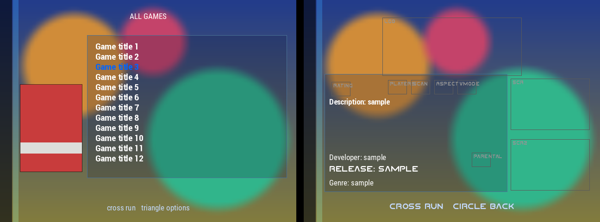
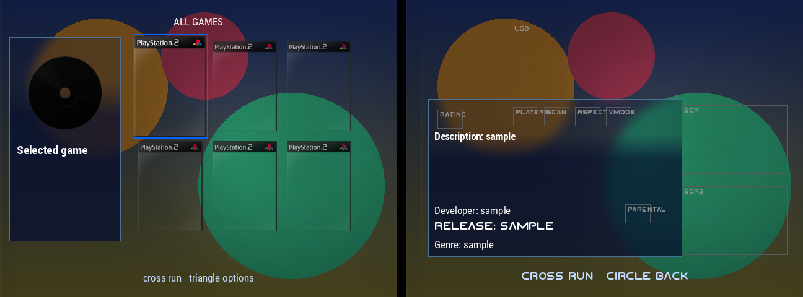

<p align="center"></p>

# RIPPS2 themes

> **[Download the build 80 themes](https://github.com/akilluminati47/RIPPS2-themes/releases/latest)** (Adapt, Adapt Rx, RIPgrid) | needs [RIPPS2 build 80](https://github.com/akilluminati47/RIPPS2/releases) or later

Themes for [RIPPS2](https://github.com/akilluminati47/RIPPS2), the PS2 front end, and the kit for
making more: key reference, a checker, a layout previewer and a left/right mirror tool. Built so that
people and coding agents alike can add a theme and know it will load before it reaches a console.

## The themes

| Theme | Look | Needs RIPPS2 |
|---|---|---|
| **Adapt** / **Adapt Rx** | akilluminati47's Adapt (RiptOPL): each game's background art under frosted glass (zoomed, not stretched, in 16:9) with Adapt's side bar as a frosted strip, the game's cover in RIPPS2's case with its reflection and the disc on one side, the list on clear glass on the other (Rx: mirrored). Info page on clear glass with 4:3 screenshots, tipping with the right stick as one plane; page morphs between them, Settings over the pillars, no towers on the game pages, the source name pops in. Art eases in. | build 80 |
| **RIPgrid** | Adapt's frosted screen and side bar with the games as a 4x2 cover grid; the selection breathes with a soft glow and tips with the right stick, games without a cover show as glass tiles with their name, and Circle cycles the sources. | build 80 |

Install: copy a `thm_...` folder into a `THM` folder on your drive (USB, HDD, MMCE, memory card), as
for any OPL theme, then pick it in RIPPS2's Settings > Interface > Theme -- or hold SELECT on the game
list for 4.2 seconds to step through the themes.

<p align="center"> </p>
<p align="center"><sub>Layout previews from <code>tools/preview_theme.py</code>: coloured blocks stand in for game art; motion, tilt and fades show on the console.</sub></p>

### On the console
- **Hold SELECT for 4.2 seconds** on the game list to step to the next theme (a quick press still refreshes the list).
- **Right stick** tips the art: the whole info page as one plane, Adapt's case and disc, RIPgrid's chosen cover.
- **RIPgrid**: the D-pad moves through the grid; **Circle** cycles the sources (USB, HDD, ALL GAMES...).

## The kit

| | |
|---|---|
| [AGENTS.md](AGENTS.md) | The rules: read first. |
| [docs/THEME_KEYS.md](docs/THEME_KEYS.md) | Every key RIPPS2 adds (Grid, frosted glass, towers, tilt, transitions...). |
| [docs/THEME_ENGINE_RiptOPL.md](docs/THEME_ENGINE_RiptOPL.md) | The engine underneath (RiptOPL's reference). |
| `tools/check_theme.py` | Will it load? Numbering, types, missing files, misplaced keys. |
| `tools/preview_theme.py` | A PNG of the game list and info page, laid out as the engine does. |
| `tools/mirror_theme.py` | Draft the other-side layout of a theme. |
| `tools/png8.py` | Make every image an 8-bit palette PNG: RIPPS2 keeps those as 8-bit textures, a quarter of the VRAM. |
| `tools/gen_adapt_family.py` | Writes the Adapt-family configs from one layout (edit it, not their `conf_theme.cfg`). |
| `previews/` | The current previews. |

```
python3 tools/check_theme.py themes/*
python3 tools/preview_theme.py "themes/thm_Adapt" previews/thm_Adapt.png
python3 tools/mirror_theme.py "themes/thm_Adapt" "themes/thm_Adapt Rx" "Adapt Rx"
```
Python 3 and Pillow (`pip install pillow`) for the previewer.
