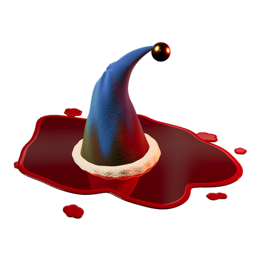

<p align="center"></p>

<h1 align="center">RIPPS2 themes</h1>

<p align="center"><b>Theme RIPPS2 without touching its code.</b><br>
Every look in RIPPS2 is a theme folder away: a <code>conf_theme.cfg</code>, 8-bit PNGs, fonts and sounds.<br>
No ELF to rebuild. Rely on the build, theme it.</p>

<p align="center">
<a href="AGENTS.md"></a>
</p>
<p align="center">


</p>
<p align="center"><sub>Written for people and coding agents alike: <a href="AGENTS.md">AGENTS.md</a> holds the rules (<code>CLAUDE.md</code>, <code>GEMINI.md</code> and <code>.github/copilot-instructions.md</code> point to it), <a href="docs/THEME_KEYS.md">THEME_KEYS.md</a> everything the engine does, and the tools check a theme before it gets near a PS2.</sub></p>

> **[Download the themes](https://github.com/akilluminati47/RIPPS2-themes/releases/latest)** (Adapt, Adapt Rx, RIPgrid) | needs [RIPPS2 build 80](https://github.com/akilluminati47/RIPPS2/releases) or later | [RIPPS2](https://github.com/akilluminati47/RIPPS2), the PS2 front end

## The themes

| Theme | Look | Needs RIPPS2 |
|---|---|---|
| **Adapt** / **Adapt Rx** | akilluminati47's Adapt (RiptOPL): each game's art under frosted glass (zoomed, not stretched, in 16:9) with Adapt's side bar as a frosted strip on the left, the game's cover in RIPPS2's case with its reflection and the disc on one side, the list on clear glass on the other (Rx swaps the list and the case, and puts LAUNCH DISC at the right of the bar, over its disc). The disc always sits right under LAUNCH DISC. Info page on clear glass with 4:3 screenshots, tipping with the right stick as one sheet; page morphs between them, Settings over the pillars, no towers on the game pages. The source name pops in (from build 81 as a toast: ALL GAMES, HDD GAMES...). | build 80 |
| **RIPgrid** | Adapt's frosted screen and side bar with the games as a 4x2 cover grid; the selection breathes with a soft glow and tips with the right stick, games without a cover show as glass tiles with their name, and Circle cycles the sources. | build 80 |

Install: copy a `thm_...` folder into a `THM` folder on your drive (USB, HDD, MMCE, memory card), as
for any OPL theme, then pick it in RIPPS2's Settings > Interface > Theme, or hold SELECT on the game
list for 4.2 seconds to step through the themes.

### On the console
- **Hold SELECT for 4.2 seconds** on the game list to step to the next theme (a quick press still refreshes the list).
- **Right stick** tips the art: the whole info page as one plane, Adapt's case and disc, RIPgrid's chosen cover.
- **RIPgrid**: the D-pad moves through the grid; **Circle** cycles the sources (USB, HDD, ALL GAMES...).

## Make your own

**[docs/THEME_KEYS.md](docs/THEME_KEYS.md) is the whole engine, as of RIPPS2 build 81**, all of it reachable
from a theme folder:

| | What a theme can do |
|---|---|
| **Look** | Frosted glass panels over each game's art, a full-screen frosted layer, side bars, clear glass, a cover **Grid**, RIPPS2's case with a reflection, 4:3 screenshots on 16:9, wide-crop backgrounds, towers on or off. |
| **Motion** | Right-stick tilt that moves a whole page as one sheet (or one cover), page morphs between the list and the info page, art that eases in, descriptions that roll, info-page slideshows, the source name as a toast. |
| **Fonts** | 16 font slots, your `.ttf` or RIPPS2's built-in faces, in capitals or not; the slots RIPPS2's own pages draw with, so a theme restyles menus, the category bar and the view word too. |
| **Colour** | The theme's colours, and its own **Colors and More**: colour theme (RIPPS2, Ember, Blood, Ectoplasm, Amethyst, Bone), category bar, hints, glyphs, category order. The user always gets the last word. |
| **Images** | Any of RIPPS2's own images (button glyphs, badges, loaders, the flying mark, the PS1 / PS2 logos) replaced by shipping a PNG of the same name. |
| **Sound** | A `sound/` folder with any of the 15 events (boot, cursor, confirm, page in and out, launch, disc...) and `sound/bgm.ogg` for its own music. |

## The kit

| | |
|---|---|
| [AGENTS.md](AGENTS.md) | The rules: read first. |
| [docs/THEME_KEYS.md](docs/THEME_KEYS.md) | Everything RIPPS2's engine does for a theme: keys, elements, fonts, effects, images, sounds. |
| [docs/THEME_ENGINE_RiptOPL.md](docs/THEME_ENGINE_RiptOPL.md) | The engine underneath (RiptOPL's reference). |
| `tools/check_theme.py` | Will it load? Numbering, types, missing files, misplaced keys, values RIPPS2 knows, 8-bit images. |
| `tools/mirror_theme.py` | Draft the other-side layout of a theme. |
| `tools/png8.py` | Make every image an 8-bit palette PNG: RIPPS2 keeps those as 8-bit textures, a quarter of the VRAM. |
| `tools/gen_adapt_family.py` | Writes the Adapt-family configs from one layout (edit it, not their `conf_theme.cfg`). |

```
python3 tools/check_theme.py themes/*
python3 tools/png8.py themes/thm_MyTheme
python3 tools/mirror_theme.py "themes/thm_Adapt" "themes/thm_Adapt Rx" "Adapt Rx"
```
Python 3, with Pillow and numpy (`pip install pillow numpy`) for `png8.py`. Then look at it for real: in
PCSX2 (System > Start File, RIPPS2.elf) with the theme on its virtual drive, or on a PS2.
